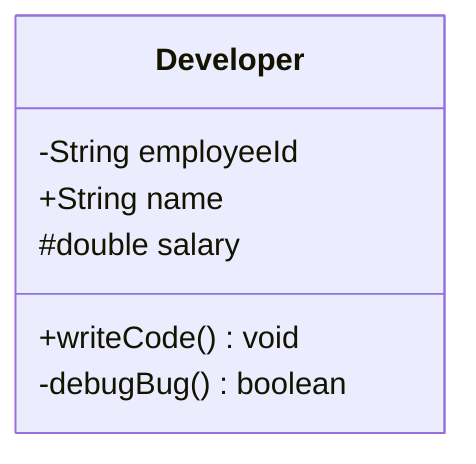
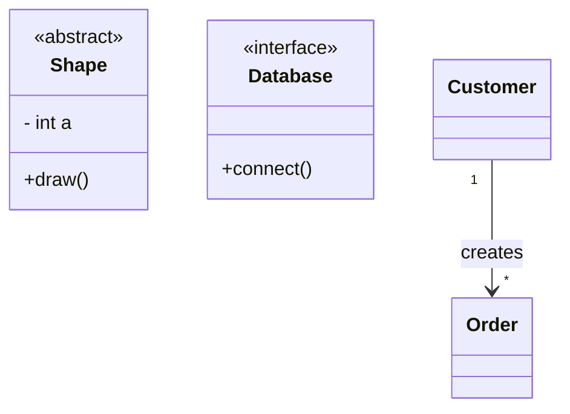
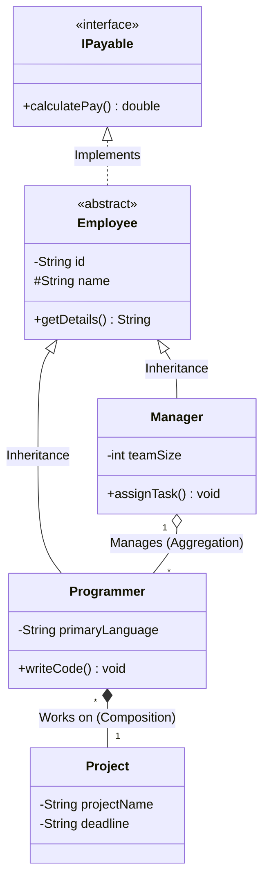

1. Tạo diagram với 1 class cơ bản

```mermaid
classDiagram
	class Developer{ 
		-String employeeId 
		+String name 
		#double salary 
		+writeCode() void 
		-debugBug() boolean } 
```
2. Hi

```mermaid 
classDiagram 
	class Shape { 
	<<abstract>> 
	- int a
	+draw() } 
	class Database { 
		<<interface>> 
		+connect() } 
	Customer "1" --> "*" Order : creates 
```
3. Tổng hợp

```mermaid
classDiagram
    %% Định nghĩa các lớp và Interface
    class IPayable {
        <<interface>>
        +calculatePay() double
    }

    class Employee {
        <<abstract>>
        -String id
        #String name
        +getDetails() String
    }

    class Programmer {
        -String primaryLanguage
        +writeCode() void
    }

    class Manager {
        -int teamSize
        +assignTask() void
    }

    class Project {
        -String projectName
        -String deadline
    }

    %% Thiết lập các mối quan hệ
    IPayable <|.. Employee : Implements
    Employee <|-- Programmer : Inheritance
    Employee <|-- Manager : Inheritance
    
    Manager "1" o-- "*" Programmer : Manages (Aggregation)
    Programmer "*" *-- "1" Project : Works on (Composition)
```
